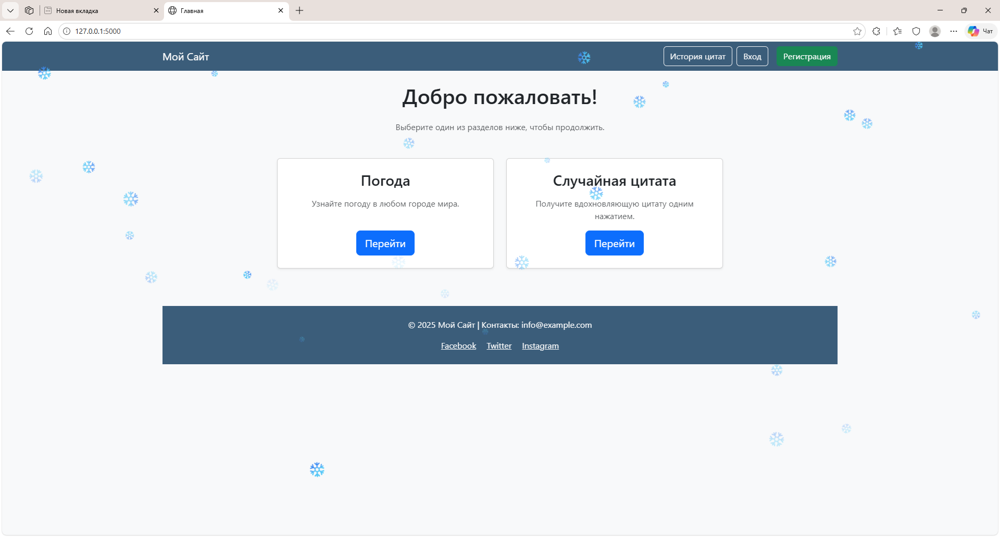
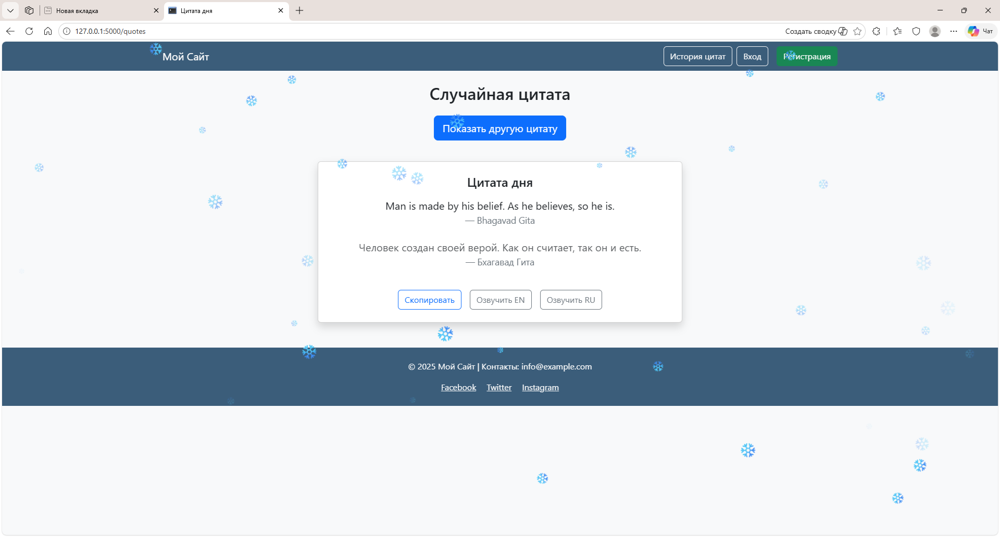
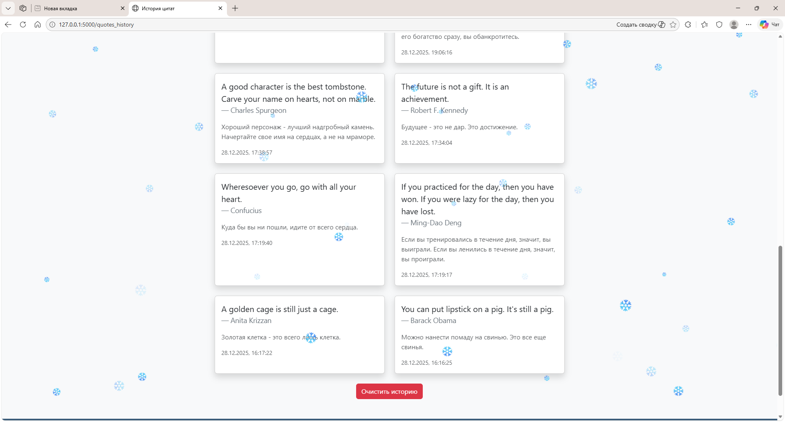
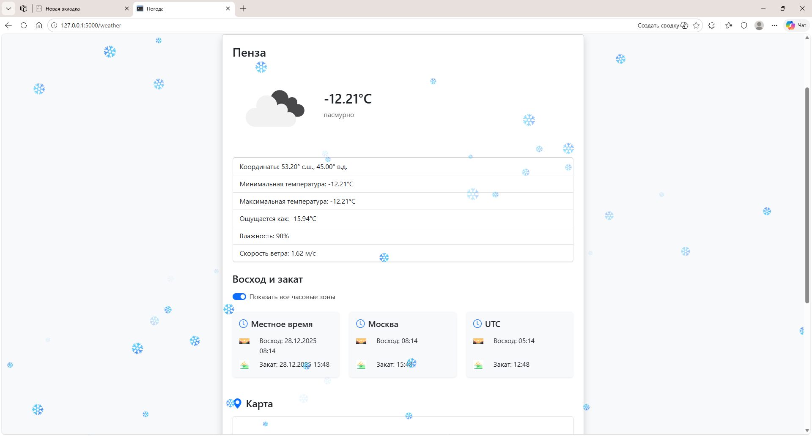
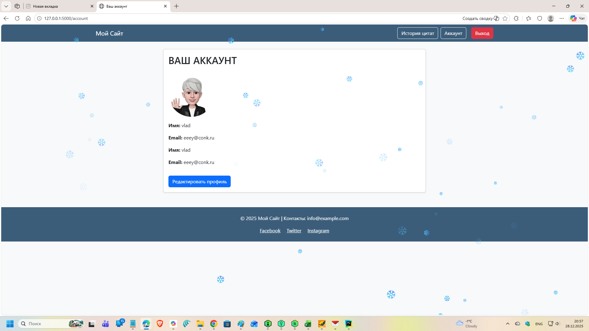

## **📘 Проект: Работа с API. 
Веб‑приложение с цитатами, погодой и пользовательскими аккаунтами**

Это Flask‑приложение объединяет несколько сервисов: генерацию случайных цитат, перевод, историю цитат, погодный модуль, регистрацию пользователей, а также современный UI с анимацией и адаптивной версткой.

---

## 🚀 **Функциональность**

### **Цитаты**
- Получение случайной цитаты через API ZenQuotes  
- Автоматический перевод цитаты на русский язык  
- Автоматическая транслитерация имени автора  
- Словарь из 200+ авторов с корректными русскими именами  
- Логирование неизвестных авторов  
- Сохранение цитат в:
  - localStorage (история для пользователя)
  - `quotes_archive.txt` (архив на сервере)
- Страница истории цитат  
- Кнопки:
  - Скопировать  
  - Озвучить EN  
  - Озвучить RU  
  - Показать другую цитату  

---

### **Погода**
- Поиск погоды по городу  
- Перевод описания погоды на русский  
- Время восхода/заката:
  - UTC  
  - Москва  
  - локальное время города 
- Продолжительность дня (ЧЧ:ММ)
- Отображение карты (Leaflet)  
- Иконки погоды  

---

### **Пользователи**
- Регистрация  
- Авторизация  
- Редактирование профиля  
- Загрузка аватара  
- Хеширование паролей (bcrypt)  

---

## 🛠 **Стек технологий**

- Python 3  
- Flask  
- Flask‑Login  
- SQLAlchemy  
- Bootstrap 5  
- Leaflet  
- MyMemory API (перевод)  
- ZenQuotes API (цитаты)  
- OpenWeather API (погода)  

---

##🐳 **Docker и подготовка к деплою**

Проект включает конфигурации для запуска в контейнерах:

- Dockerfile — сборка образа
- docker-compose.yml — базовая конфигурация
- docker-compose.dev.yml — окружение разработки
- docker-compose.prod.yml — окружение продакшена
- gunicorn.conf.py — конфигурация Gunicorn
- deploy/nginx/nginx.conf — конфигурация Nginx
- deploy/certs/ — директория для SSL‑сертификатов

Эти файлы используются в учебных целях для подготовки к деплою на VPS или облачный сервер.

---

## 📁 **Структура проекта**

```
VD08-Working-with-APIs/
│
├── app/
│   ├── data/
│   │   └── quotes_archive.txt
│   ├── static/
│   │   ├── avatars/
│   │   │   └── default.png
│   │   ├── icons/
│   │   │   ├── sunrise.jfif
│   │   │   └── sunset.jfif
│   │   ├── snow.js
│   │   └── style.css
│   ├── templates/
│   │   ├── account.html
│   │   ├── base.html
│   │   ├── edit_profile.html
│   │   ├── home.html
│   │   ├── login.html
│   │   ├── quotes.html
│   │   ├── quotes_history.html
│   │   ├── register.html
│   │   └── weather.html
│   ├── authors.py
│   ├── forms.py
│   ├── models.py
│   ├── routes.py
│   ├── translit.py
│   ├── utils.py
│   └── __init__.py
│
├── deploy/
│   ├── certs/
│   ├── certs-data/
│   └── nginx/
│       ├── logs/
│       └── nginx.conf
│
├── instance/
│   └── site.db
│
├── screenshots/
│   ├── account.png
│   ├── edit_profile.png
│   ├── history.png
│   ├── home.png
│   ├── quotes.png
│   └── weather.png
│
├── .env
├── .gitattributes
├── .gitignore
├── config.py
├── create_db.py
├── docker-compose.yml
├── docker-compose.dev.yml
├── docker-compose.prod.yml
├── Dockerfile
├── gunicorn.conf.py
├── LICENSE
├── main.py
├── missing_authors.log
├── README.md
├── READMEru.md
├── READMEen.md
└── requirements.txt

```
---


## 📦 **Установка и запуск**

```bash
git clone <repo_url>
cd <project_folder>

python -m venv .venv
source .venv/bin/activate   # Windows: .venv\Scripts\activate

pip install -r requirements.txt
python main.py
```
---

## 🔧 **Особенности реализации**

- Умная транслитерация имён авторов  
- Исключения для служебных слов: *de, van, von, da, di…*  
- Логирование неизвестных авторов  
- Архив цитат на сервере  
- История цитат в браузере  
- Анимация карточек (flip‑card)  
- Снежинки на фоне  
- Адаптивный дизайн  

---

## 📸 Скриншоты

<table>
  <tr>
    <td align="center">
      
      <div style="margin-top: 8px; font-weight: bold;">Главная страница</div>
    </td>
    <td align="center">
      
      <div style="margin-top: 8px; font-weight: bold;">Страница цитат</div>
    </td>
  </tr>

  <tr>
    <td align="center">
      
      <div style="margin-top: 8px; font-weight: bold;">История цитат</div>
    </td>
    <td align="center">
      
      <div style="margin-top: 8px; font-weight: bold;">Погода</div>
    </td>
  </tr>

  <tr>
    <td align="center">
      
      <div style="margin-top: 8px; font-weight: bold;">Профиль пользователя</div>
    </td>
    <td align="center">
      
      <div style="margin-top: 8px; font-weight: bold;">Редактирование профиля</div>
    </td>
  </tr>
</table>

---

## 📌 **Планы развития**

- Экспорт цитат в формат CSV
- Страница просмотра архива 
- Тёмная тема
- Автоматическое пополнение словаря авторов  
- Улучшенная анимация карточек  
- Полноценный деплой (Docker + Gunicorn + Nginx)

---

## 📄 Лицензия

Лицензия MIT (или любая другая по вашему выбору)

---

👤 Автор

Разработано в рамках учебного проекта, посвященного интеграции API, архитектуре Flask и современному пользовательскому интерфейсу.

---

Vladimir  
📧 vladtma@tutamail.com

```